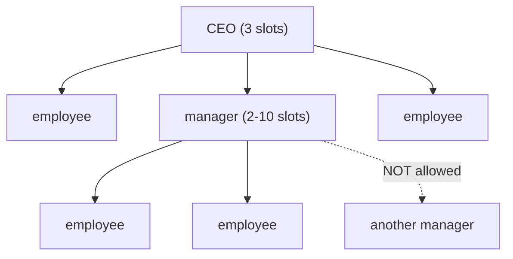

Each turn you rebuild your company as a **pyramid**. The shape constrains everything: how many
cards can act, who reports to whom, and (via open slots) who chooses turn order first.

## The rules

- The structure **always contains the CEO**. (base rules, p.7)
- The **CEO has 3 slots** (printed as 3 rectangles on the card).
- Cards reporting to the CEO may be **normal staff OR managers** (black cards only).
- Each **manager has 2-10 slots**, as printed on the card.
- Cards reporting to a manager may **only be normal employees — not other managers.**
- In turn 1, the CEO is the only card and is **always at work**.

(base rules, p.7)

> ⚠️ **No manager-under-manager.** A manager can only have normal employees report to her. If
> you want a deep chain, that is not how FCM structures work — depth is one level of managers
> plus their staff.

## The overfill penalty

> "If a player has inadvertently placed more cards than can fit into the company structure, all
> cards **except the CEO** are placed on the beach and the player has to play his turn with
> **only the CEO**." (base rules, p.7)

This is a **catastrophic** penalty — you lose your whole working day. An agent must validate
its structure against slot counts **before** submitting.

## Open slots and turn order

An **open slot** is a slot on the CEO or a manager **not occupied by an employee card**.
(base rules, p.7)

- **Phase 2 priority: the player with the most open slots chooses turn position first**, then
  second-most, etc.
- **Tie-break:** whoever was **ahead in turn order the previous turn** chooses first.
- The **"First airplane campaign"** milestone adds **2 extra open slots** purely for this
  priority — those slots **cannot hold managers or employees**. (base rules, pp.7,14)

> ⚠️ **Counter-intuitive:** building a *full* company makes you choose turn order **last**.
> Leaving slots deliberately open is sometimes worth it. This is why the airplane milestone
> is powerful — it gives priority without costing you structure space.

## Slot count changes after the bank breaks

After the first bank break, the **most common** slot number (2/3/4) among the revealed reserve
cards sets **all CEOs' slots from the next turn on**. (base rules, p.10) See
[[bank-and-reserve-cards]].

## Restructuring timing

- Phase 1 chooses cards *simultaneously* and places them face down; all players reveal at once.
  (base rules, p.7)
- The slot change from reserve cards is applied after reserve cards are opened — so the new
  slot count governs the structure you build.
- Cards **at work** act this turn; cards **on the beach** do not act but can be **trained** and
  still cost **salary**.

## Related

- [[turn-structure-and-phases]] — phases 1 and 2 in full
- [[employees-overview]] — which cards are managers (black) vs staff
- [[salary-and-payday]] — the cost of holding cards you are not using
- [[bank-and-reserve-cards]] — where slot changes come from
