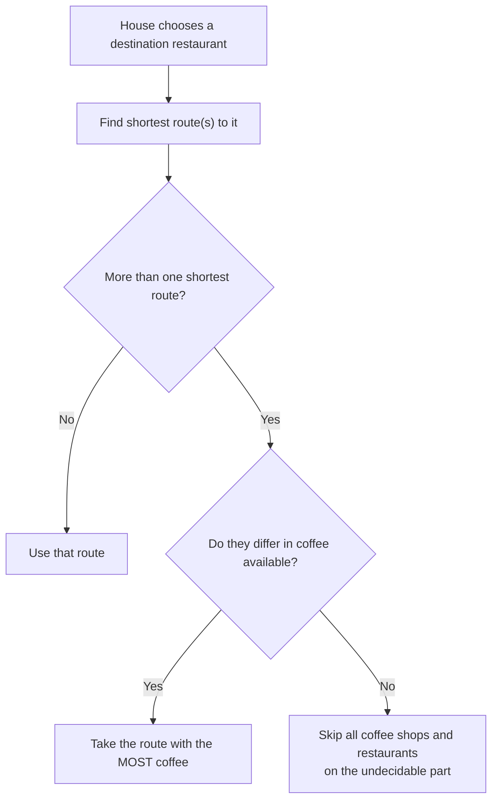

**Module purpose:** "the 'Coffee' module makes board positions even more important. Try using this
one stand-alone, with or without the 'New Milestones' module." (ketchup rules, p.6)

Coffee sells **on the way to** a house, not at the destination. That single fact makes road layout
and route choice strategically central.

## The core mechanics

| Rule | Detail |
|---|---|
| Coffee per location | Each house consumes **only 1 coffee per location** |
| En-route consumption | Houses **stop and consume coffee at each location en route** to their destination |
| Destination rule | People **never drink coffee in their destination restaurant** |
| Route choice | If multiple ways to reach the destination, the house takes the **shortest route** |
| Tie-break 1 | Among multiple shortest routes, choose the one providing the **most coffee** |
| Tie-break 2 | If still tied, the house **skips all coffee shops and restaurants** along the undecidable part of the route |
| Distance measure | Distance is measured in **map tiles**, not road squares travelled |

(ketchup rules, p.10)

> ⚠️ **Two counter-intuitive points an agent must not miss:**
> 1. **Coffee is not consumed at the destination restaurant** — so a coffee shop *at* the
>    destination earns nothing from that house's trip.
> 2. **Distance is counted in map tiles**, not road squares. This differs from the base game's
>    dinnertime distance rule, which counts road steps. (ketchup rules, p.10 vs base rules, p.10)

## Payment

> "For each coffee, they will pay just as they would for a food or drink item, including bonuses
> from cards, gardens, etc." (ketchup rules, p.10)

So coffee income follows the **base dinnertime payment rules** — unit price, plus bonuses, with
garden doubling applying to the unit price portion. See [[dinnertime-sales-resolution]].

## Cleanup

- During cleanup, **all remaining coffee markers are discarded**.
- **Coffee cannot be stored in a freezer.** (ketchup rules, p.10)

> ⚠️ This makes coffee **perishable**. Unlike food/drink (which the "First to throw away
> drink/food" milestone lets you freeze), coffee must be sold the turn it exists.

## The coffee shop build (milestone-triggered)

> "The first player(s) to sell coffee gain(s) the associated milestone and get(s) to build an
> additional coffee shop in the cleanup phase directly after they sold their first coffee.
> These are built in **turn order**. There is **no range restriction**, but the **limit of one
> coffee shop per tile** still applies." (ketchup rules, p.10)

Key details:

| Rule | Detail |
|---|---|
| Timing | Built in the **cleanup phase** immediately after first coffee sale |
| Order | Built **in turn order** |
| Range | **None** — no range restriction |
| Limit | **One coffee shop per tile** |

> 💡 **Note "the first player(s)"** — plural. Multiple players selling their first coffee in the
> same turn each get the milestone, consistent with the base rule that milestones can be shared
> within the same turn. See [[milestones-overview]] for that timing rule.

## Interaction with the New Milestones module

The **"First coffee sold"** milestone is *excluded* from the new milestone set **unless** the
Coffee module is also in use. (ketchup rules, p.8) See [[expansion-new-milestones]].

## Interaction with noodles

**Noodles may not be used as a substitute for coffee.** (ketchup rules, p.12) See
[[expansion-noodles-and-kimchi]].

## Related

- [[expansion-overview]] — where Coffee sits among the modules
- [[expansion-new-milestones]] — the "First coffee sold" milestone
- [[dinnertime-sales-resolution]] — the payment rules coffee follows
- [[expansion-noodles-and-kimchi]] — noodles explicitly excluded as a coffee substitute
- [[houses-gardens-and-demand]] — gardens, which still apply to coffee payment
