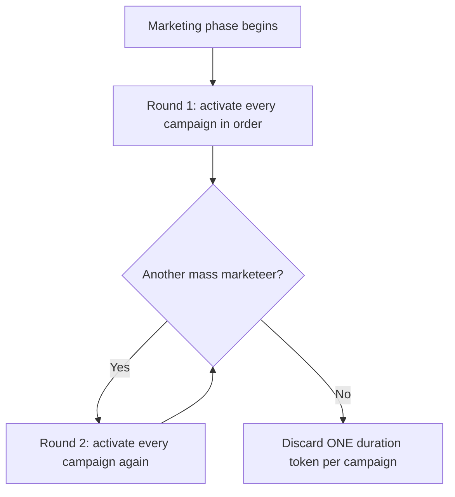

## Mass marketeers

**Components:** Mass marketeer employee cards. (ketchup rules, p.14)

**Purpose:** "We wanted to enable a style of play where you can **flood the market with demand**.
This idea can be especially vicious when combined with some other expansions that allow for more
goods to be marketed to a site." (ketchup rules, p.14)

### Rules

- The mass marketeer is an employee card that can be **trained from** mass marketeer cards.
- It **is a marketing employee** and follows all the rules for those cards.
- 🚨 **For each active mass marketeer, run an ADDITIONAL marketing campaign phase.**
  - 1 mass marketeer → **2** campaign phases
  - 2 mass marketeers → **3** phases, etc.
- 🚨 **The effect is GLOBAL and additive — it does not matter which player played them.**
- The campaign's **duration marker is only discarded after the last round** of campaigns in that
  phase. So you run 2+ phases first, then discard **one** token from each campaign tile.
- **Complete all campaigns once, then start the next series.** Example: with radio "1" and
  billboard "11" active and one mass marketeer, you activate radio "1" then billboard "11", then
  repeat — radio "1" then billboard "11".

(ketchup rules, p.14)

> ⚠️ **Global effect is the trap.** An agent should not assume a rival's mass marketeer is harmless
> — it **multiplies marketing for everyone**, including you. Conversely, playing one helps your
> rivals too. It is not a private benefit.

## Rural marketeers

**Components:** related to the **"First rural marketeer used"** milestone, which lets you
**place a highway off-ramp**. (ketchup rules, p.4)

- Recommended pairing: *City builder* = Lobbyist + New districts + **Rural marketeers**, and
  *Overtime* includes rural marketeers. (ketchup rules, p.6)
- The milestone trigger follows the module-wide **"used"** rule — the marketeer must actually have
  been used, not merely played. See [[expansion-new-milestones]].

> ⚠️ **Confidence note:** the extracted prose covers the rural marketeer's milestone and its
> recommended pairings, but not its full card text. The off-ramp's placement rules are on the card.
> Flagged rather than invented.

## Lobbyists

**Components:** Lobbyist employee cards, **"First Lobbyist Used"** milestone cards, new road tiles,
park tiles, road block markers, and optionally a new city map tile with two parks. (ketchup rules, p.6)

- The **"First lobbyist used"** milestone lets you **add a tile to the city**. (ketchup rules, p.4)
- Recommended pairings: *City builder* (Lobbyist + New districts + Rural marketeers), *First mover*
  and *First mover* includes Lobbyists. (ketchup rules, p.6)

## Night shift managers

- Recommended pairings: *Nightlife* = New milestones + **Night shift managers**;
  *Overtime* also includes them. (ketchup rules, p.6)
- In the **base game**, `NIGHT_SHIFT_MANAGER` is an existing card whose implementation paradigm is
  "produce one extra time" — see the implementation notes in the project's dev skill.

> ⚠️ **Confidence note:** the extracted expansion prose lists night shift managers in the pairings
> and the milestone sheet, but does not restate their card rules (they appear to be base-game cards
> that the Ketchup module's milestone set interacts with). Verify against the cards.

## New districts

- Recommended pairing *Korean city* requires **at least 1 apartment building tile** in the city.
  (ketchup rules, p.6)
- Adds city tiles, **park tiles**, and apartment buildings.

> ⚠️ **Confidence note:** districts' tile-placement rules are component/card driven and not fully
> captured in the extracted prose.

## Hard choices

- Ships **5 Milestone depletion markers**.
- Implemented via the **"Remove after turn 2"** markers, which expire three entry-tier milestones.
- Recommended pairing: *First mover* and *Overtime* both reference it; *Henri Lo menu* excludes it.

See [[expansion-new-milestones]] for the depletion mechanic in full.

## Related

- [[expansion-overview]] — the complete module list and all curated pairings
- [[expansion-new-milestones]] — the "used" rule and "Remove after turn 2"
- [[marketing-campaigns]] — base campaign rules the mass marketeer multiplies
- [[turn-structure-and-phases]] — where extra marketing phases fit
