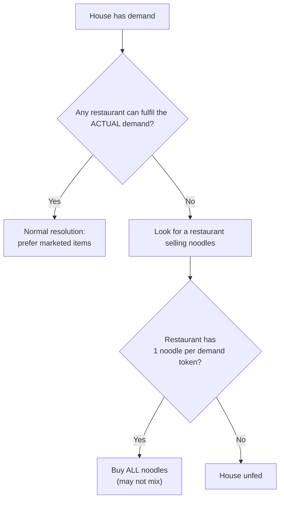

## Noodles module

**Components:** noodle cook and noodle chef employee cards; wooden noodle pieces; an additional
luxury manager employee card. (ketchup rules, p.12)

**Purpose:** "Noodles can replace any other food or drink; however, houses will always **prefer the
items marketed to them** over noodles if they have a choice." (ketchup rules, p.12)

### Rules

- Noodles are produced by **noodle cooks and chefs** in the same way as other food.
- **Noodles cannot be marketed.**
- During dinnertime, if a house (or apartment, or the rural area) **cannot find any restaurant that
  can fulfil its demand**, they will look for a restaurant that **sells noodles**.
- That restaurant needs **one noodle for each demand token** (food or drink) on the house.
- 🚨 **You must fulfil the ENTIRE demand with noodles — you may not mix noodles and other food for
  the same house.**
- Noodles earn **the same as any other food or drink**.
- **Noodles may not be used as a substitute for coffee.**
- Noodles **count as food for milestone purposes**.
- Noodles **can be stored in a fridge/freezer**.

(ketchup rules, p.12)

> ⚠️ **The all-or-nothing rule is the trap.** Intuitively an agent might think "I have 1 burger and
> 3 noodles for a 4-item demand — I can cover it." **No.** Either every token is a noodle, or you
> cannot use noodles for that house at all. And since noodles must equal the *total* demand token
> count, a 4-token house needs exactly 4 noodles.

> ⚠️ **Noodles are a fallback, not a preference.** They only come into play when **no** restaurant
> can fulfil the real demand. If any chain can serve the actual items, noodles never substitute.

## Kimchi module

**Components:** Kimchi Master employee card, plus the Kimchi milestone.

**Interactions:** the rulebook directs readers to the kimchi rules for how **sushi, noodles and
kimchi interact**. (ketchup rules, p.12)

Practical points recorded from the module description:

- **Kimchi Master** is referenced in the base game's card-supply notes as a top-position card.
- Kimchi is tied to the **New Districts** module for full effect — the recommended pairing is
  *Korean city* = **New districts (at least 1 apartment building tile) + Kimchi**. (ketchup rules, p.6)

> ⚠️ **Confidence note:** the extracted text of the Kimchi section does not state its per-card rules
> as verbatim prose in the same way as noodles/coffee; the module's detail is largely in card text
> and the referenced cross-rules. This page records what the extracted rulebook states and flags
> the rest rather than inventing it. Verify against the physical Kimchi cards.

## Sushi module

**Components:** Sushi Chef employee card.

- Listed among the modules with cross-interactions to kimchi and noodles (ketchup rules, p.12).
- Recommended pairing *Upmarket Area* = New milestones + Park tile from new districts +
  **Gourmet food critic** + **Sushi**. (ketchup rules, p.6)

> ⚠️ **Confidence note:** as with kimchi, the sushi module's per-card detail is not fully spelled
> out in the extracted prose. Flagged rather than guessed.

## Milestone interaction

Noodles **count as food** for milestone purposes (ketchup rules, p.12) — relevant to the base
"First burger/pizza produced" style triggers if they are in play, and to any noodle-specific
milestone.

## Related

- [[expansion-overview]] — module list and the Korean/Asian Fusion pairings
- [[expansion-coffee]] — noodles are explicitly **not** a coffee substitute
- [[production-and-food-stock]] — how food is produced and stored
- [[dinnertime-sales-resolution]] — where noodle substitution happens
- [[employees-overview]] — the base employee card set these add to
