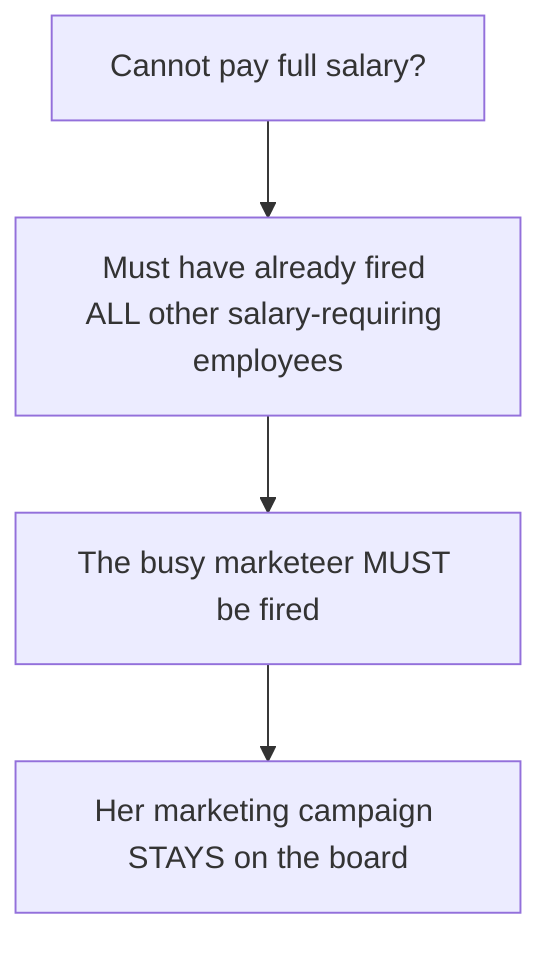

Phase 5 is where FCM punishes over-expansion. Salary is charged on cards you are not even
using, so "hire everything" loses. (base rules, p.11)

## Step 1: Fire (optional, before paying)

Each chain **may fire any number of people** in its company structure **or on the beach**.
Fired cards go **back to the general stock** of available cards. (base rules, p.11)

> ⚠️ **Marketeers that are busy may normally NOT be fired.** (base rules, p.11)

## Step 2: Pay

- Pay **$5 for each card** in structure **or on the beach** that has a **$ icon**.
- **Paid wages go back to the bank.**
- **Busy marketeers that require salary must still be paid.** (base rules, p.11)

> ✅ **The salary list is "cards with the $ icon", not a fixed list of job titles.** Which
> specific cards carry the icon is fixed by the physical cards; verify per card. The
> exhaustive per-card answer belongs in [[employees-overview]].

## Salary discounts

| Source | Discount |
|---|---|
| **Recruiting Manager** with unused hiring capacity | **$5 per leftover action** |
| **HR Director** with unused hiring capacity | **$5 per leftover action** |
| **"First to train someone"** milestone | **$15 flat discount** on salary costs |

- Leftover recruitment actions on the **recruiting manager** and **HR director** each reduce
  salary by **$5**. (base rules, p.11)
- **All available discounts must be used.** (base rules, p.11)
  - This is explicitly called out as relevant to the **"First to pay $20 in salaries"**
    milestone: discounts reduce what you actually pay, and that milestone counts only
    salaries **actually paid out**.
- **Salary costs can never go below $0.** (base rules, p.13)

### The legal discount-avoidance trick

Because you must use all discounts, you can *deliberately remove* a discount before phase 5 by
**using** the recruiting manager / HR director to hire someone during the working day. Then
her discount no longer exists at payday. This is explicitly acknowledged by the rulebook as a
legal way to reach the "$20 paid in salaries" milestone. (base rules, p.13)

## When you cannot pay

> "In exceptional cases, a player may have no money but an obligation to pay a busy
> marketeer. In this case, the marketeer **must be fired**. The corresponding marketing
> campaign **remains on the board**. Note that this is only allowed if you have already fired
> all of your other employees that require a salary." (base rules, p.11)

So the ordering is:

> ⚠️ **Your liabilities do not evaporate.** Firing a busy marketeer solves the salary problem
> but leaves her campaign on the board — which may keep generating demand you cannot serve,
> or serve a rival.

## Interaction with the game end

If the bank breaks a **second** time in phase 4, **salaries are not paid this turn** — the
game ends immediately at the end of phase 4. (base rules, p.10) See [[bank-and-reserve-cards]].

## Related

- [[employees-overview]] — which cards carry the salary icon
- [[dinnertime-sales-resolution]] — the phase that produces the money to pay with
- [[milestones-overview]] — the salary-related milestones in full
- [[marketing-campaigns]] — why busy marketeers cannot be fired
