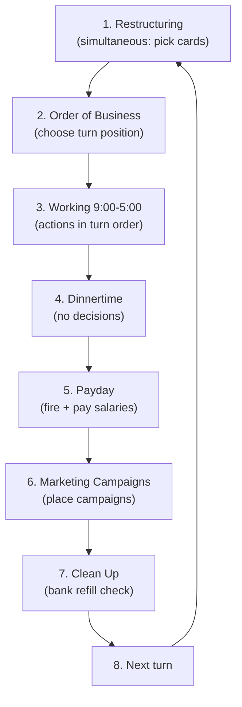

A turn in Food Chain Magnate runs through 8 phases in fixed order. Phases 1, 2 and 3 are
where players make decisions; phases 4-8 are largely mechanical resolution. Understanding
which phase allows which action is the single most important prerequisite for acting
legally — an agent that tries to hire during phase 2 has misunderstood the game.

## Phase 1: Restructuring

**Simultaneous.** Each player secretly chooses which employees to use this turn, then all
players reveal at once.

- Chosen cards are "**at work**". All others are "**on the beach**".
- Cards on the beach **cannot be used** this turn, **can be trained**, and **still require
  salary** unless fired. (base rules, p.7)
- In turn 1, the CEO is the only card played. The CEO is **always at work**.
- From turn 2 on, cards at work must be arranged into a **company structure** (a pyramid):
  - The CEO sits at the top and has **3 slots**.
  - Cards reporting to the CEO may be normal staff **or managers** (black cards only).
  - Each manager has **2-10 slots**; cards reporting to a manager may only be **normal
    employees, not other managers**. (base rules, p.7)
- **Penalty for overfilling:** if a player places more cards than fit the structure, all
  cards **except the CEO** go to the beach, and the player plays the turn with the CEO
  alone. (base rules, p.7)
- After bank reserve cards are opened, the CEO may **gain or lose a slot**.

> Ordering note: restructuring happens *before* reserve cards are read for the slot change,
> but the slot change applies to the structure built this turn.

## Phase 2: Order of Business

Players choose their position on the turn order track.

- **Priority: most open slots chooses first**, then second-most, and so on. An open slot is
  a slot on the CEO or a manager not occupied by an employee card. (base rules, p.7)
- The **"First airplane campaign"** milestone counts as **+2 open slots**.
- **Tie-break:** the player who was ahead in turn order in the *previous* turn chooses first.
- Only as many spots exist as there are players — with 3 players you cannot take 4th position.

## Phase 3: Working 9:00-5:00

Players act **in turn order**. Each player completes **all** their actions before the next
player goes.

- One action per card **at work**.
- **Mandatory** actions: pricing manager, discount manager, luxury manager, CFO, recruiting
  manager, HR director, waitress. **All other employees' actions are optional.** (base rules, p.7)
- **Actions must be performed in the order listed in the rulebook** — the position of a card
  in the org chart has no influence on action order.

Action order (base rules, pp.7-10):

1. **Recruit** — CEO gives 1 free recruitment action; each recruitment action hires one
   additional employee. Hiring is only at **entry positions**. New hires go **on the beach**.
   (recruiting girl 1x, recruiting manager 2x, HR director 4x)
2. **Train** — each training action trains one person one step. Only cards **on the beach**
   can be trained (including just-hired ones). Cards at work and busy marketeers cannot.
3. **Set prices / hire marketeers** — see [[price-managers-and-pricing]]
4. **Place marketing campaigns**
5. **Get food & drinks**
6. **Place/move restaurants, open new restaurants, play the waitress**
7. **Other actions** (e.g. CFO +50% cash)

> See [[working-day-actions]] for the full step-by-step of each action.

## Phase 4: Dinnertime

**No player decisions.** Houses eat in ascending order of the number printed on the house,
starting with the lowest. See [[dinnertime-sales-resolution]] for the full decision procedure.

## Phase 5: Payday

Each chain may fire any number of people (structure or beach). Then each chain pays **$5 per
card** with a salary icon, in structure or on the beach. Busy marketeers that require salary
must still be paid. See [[salary-and-payday]].

## Phase 6: Marketing Campaigns

Campaigns placed in phase 3 take effect. Each player may also place the campaign tied to
marketeers at work this turn (see [[marketing-campaigns]]).

## Phase 7 + 8: Clean Up / Next Turn

Remaining milestone cards that have been claimed at least once are **removed from the game**.
Bank refill is checked. See [[bank-and-reserve-cards]] and [[milestones-overview]].

## Related

- [[milestones-overview]] — milestone timing depends heavily on phase order
- [[salary-and-payday]] — phase 5 in full
- [[dinnertime-sales-resolution]] — phase 4 in full
- [[company-structure-and-slots]] — slot rules used in phases 1 and 2
