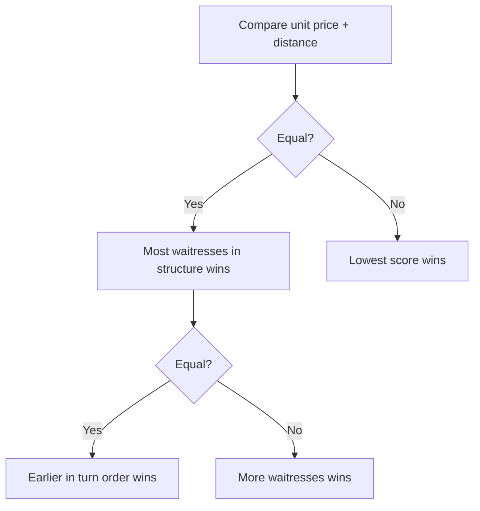

Waitresses matter in two completely different ways — as **income** and as a **tie-breaker**.
An agent needs both.

## 1. Income

After **all houses** have been processed in dinnertime, each chain receives:

- **$3** for each waitress **in its structure**, or
- **$5** with the **"First waitress played"** milestone.

(base rules, p.10)

> ⚠️ **Structure only.** "Each waitress in their structure" — a waitress **on the beach** does
> not pay. She must have been chosen at restructuring and placed in the org chart.

## 2. Tie-break in dinnertime competition

When two chains have the **same** `unit price + distance`, the house goes to the chain with the
**most waitresses in its structure**. (base rules, p.10)

If they *also* tie on waitress count, the house goes to the chain **earlier in turn order**.
(base rules, p.10)

> 🔢 **Practical implication:** waitresses are the *only* way to win a price+distance tie before
> turn order enters. If you expect to contest a house at an equal price+distance, a waitress is
> effectively a **tie-break token** worth more than her $3.

## 3. The action is mandatory

Waitress is in the **mandatory** action list — if she is at work, you take the $3. (base rules, p.7)

## 4. The milestone

**"First waitress played"** is awarded when you play a waitress **in your structure** (not on the
beach). Effect: waitresses pay **$5 instead of $3**. Applies to the waitress played to get it.
(base rules, p.12) See [[milestones-overview]].

Also note this milestone is triggered in **dinnertime** (phase 4), since a waitress's action is
part of the working day but her "played in structure" status is what matters — verify the exact
timing against the milestone table in [[milestones-overview]].

## Related

- [[dinnertime-sales-resolution]] — the competition formula and tie-breaks
- [[milestones-overview]] — the waitress milestone
- [[employees-overview]] — the waitress card
- [[price-managers-and-pricing]] — the other half of the price+distance score
