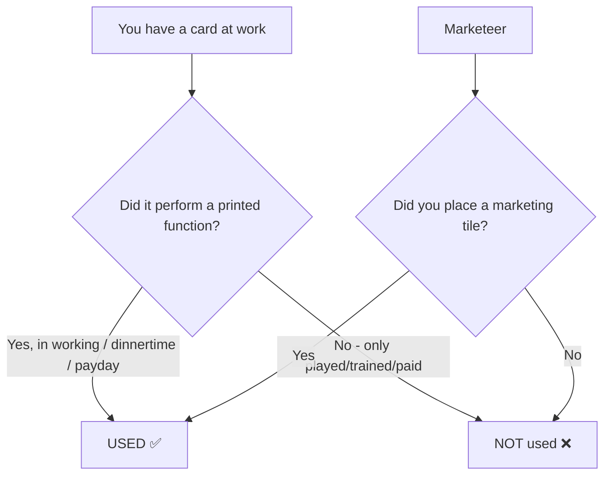

> 🚨 **This module REPLACES the base milestones entirely.**
> "Remove **all** the milestone cards from the base game. Instead, use the new milestone cards
> provided except ketchup, first coffee, first rural marketeer, and first lobbyist (unless you are
> also using these modules)." (ketchup rules, p.8)
> When this module is on, [[milestones-overview]] does **not** apply.

## Setup

- Take **3 "Remove after turn 2" markers** and the new airplane marketing tiles.
- Place a "Remove after turn 2" marker on these three piles:
  - **"First marketeer used"**
  - **"First trainer used"**
  - **"First recruiting girl used"**

(ketchup rules, p.8)

## 🚨 The central rule: "used" is not "played"

This is the mechanic the whole module is built on, and the easiest thing for an agent to get wrong.

> "Note that many of the new milestones require you to **use** a card, not just **play** it. A card
> is **used** if it performs at least one function printed on the card during the working 9:00-5:00,
> dinnertime or payday phase. **Playing a card, training a card, or paying salary for it, does not
> in itself count as using it.** Marketeers are only used if you **actually place a marketing tile**
> with them; if you do not place a tile, you do not get the corresponding milestone."
> (ketchup rules, p.8)

Decomposed:

| Action | Counts as "used"? |
|---|---|
| Card performs a printed function in working hours / dinnertime / payday | ✅ **yes** |
| Choosing the card at restructuring (playing it into the structure) | ❌ no |
| Training the card | ❌ no |
| Paying its salary | ❌ no |
| Marketeer that places a marketing tile | ✅ **yes** |
| Marketeer that does **not** place a tile | ❌ **no** — no milestone |

> ⚠️ **Consequence for planning:** you cannot bank a "first X used" milestone by merely having the
> card in your structure. It has to have actually **done its job this turn**. For an optional-action
> card, that means you must choose to exercise it.

## "Remove after turn 2" and depletion markers

- After turn 2, any milestone still bearing a "Remove after turn 2" marker that is **still
  available** is removed. (ketchup rules, p.8)
- The module also ships **5 Milestone depletion markers** for the **Hard choices** variant.

### Hard choices

> "In the new milestone module, we forced players to choose between three 'starting' milestones.
> It is possible to do the same with the original milestones."

The initial set of milestones is only available for a limited time — this is what the
**"Remove after turn 2"** markers implement: the three entry-tier milestones
(*First marketeer used*, *First trainer used*, *First recruiting girl used*) expire after turn 2,
forcing an early strategic commitment rather than letting everyone collect the same easy
milestones in the opening rounds. (ketchup rules, pp.8,17)

## New milestones introduced by this module

The rulebook's milestone card sheet lists these additional milestones alongside the base set
(the base ones are reused, with the wording above changing *some* triggers to "used"):

| Milestone | Trigger | Effect |
|---|---|---|
| **First marketeer used** | Actually place a marketing tile with a marketeer | *(entry-tier; removed after turn 2)* |
| **First trainer used** | Actually train someone with a trainer | *(entry-tier; removed after turn 2)* |
| **First recruiting girl used** | Actually hire via a recruiting girl | *(entry-tier; removed after turn 2)* |
| **First rural marketeer used** | Use a rural marketeer to place a highway off-ramp | Place highway off-ramp (requires the Rural marketeers module) |
| **First coffee sold** | Sell your first coffee | Build one coffee shop in the next cleanup phase (requires Coffee module) |
| **Someone sells "your" demand** | Another player sells demand that **you** marketed | Distance **−1** (the Ketchup module) |
| **First lobbyist used** | Use a lobbyist | Add a tile to the city (requires Lobbyist module) |

(ketchup rules, pp.4,8,13,16)

> ⚠️ The three later entries only exist **if their module is also in play** — the rulebook says to
> exclude those cards unless you are using the corresponding module. (ketchup rules, p.8)

## The Ketchup milestone: "Someone sells your demand"

- **Components:** Ketchup milestone cards titled "Someone sells your demand".
- **Effect:** **Distance −1.**
- **Trigger:** someone else sells demand that you marketed.

(ketchup rules, pp.4,13)

> 💡 This is thematically the "ketchup" of the game — you market a house, a rival actually serves
> it, and you still get value by being pulled closer. It rewards marketing into contested space
> rather than only into your own supply area.

## Related

- [[expansion-overview]] — module list and which ones contradict the base game
- [[milestones-overview]] — the base milestone set, **void** when this module is on
- [[expansion-coffee]] — the Coffee module and its milestone
- [[expansion-marketing-modules]] — rural/lobbyist milestones' parent modules
- [[turn-structure-and-phases]] — the phases in which a card can be "used"
