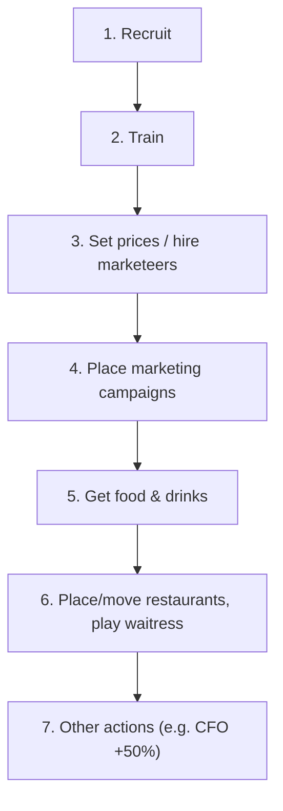

Phase 3 ("Working 9:00-5:00") is where all player actions happen. Two rules dominate:

1. **Actions must be performed in the rulebook's listed order**, not the org-chart order.
2. **Some actions are mandatory** — having the card at work forces the action.

> "Actions have to be performed in the order listed here; **the position of a card in the
> organizational chart has no influence.**" (base rules, p.7)

## Turn order within the phase

Players act in **turn order**. **Each player completes all of his actions before the next
player gets his turn.** (base rules, p.7)

## Mandatory vs optional

| Mandatory (must do if card is at work) | Optional |
|---|---|
| Pricing Manager (price −$1) | everything else |
| Discount Manager (price −$3) | |
| Luxuries Manager (price +$10) | |
| CFO (+50% cash earned) | |
| Recruiting Manager | |
| HR Director | |
| Waitress (get $3) | |

(base rules, p.7)

> ⚠️ **Mandatory means mandatory.** An agent cannot "decline" a luxury manager's +$10 price
> increase or skip paying a waitress's tip. These fire automatically.

## The action order



### 1. Recruit

- The **CEO always grants 1 free recruitment action**.
- Each recruitment action available hires **1 additional employee**.
- **Hiring is only at entry positions** (▲).
- New hires go **on the beach**.
- Recruitment actions come from: **Recruiting Girl (1x)**, **Recruiting Manager (2x-ish)**,
  **HR Director (4x)**.
- If a deck is out of a card type, you may not hire it — **unless you immediately train it to a
  higher level** in this turn's training sub-phase (so you never actually take the low card).
- **Unused** recruitment actions on the Recruiting Manager / HR Director give a **salary
  discount** in phase 5.

(base rules, p.7)

### 2. Train

- Each training action trains **one person one step**.
- Only cards **on the beach** (including just-hired) can be trained.
- Cards **at work** and **busy marketeers** **cannot** be trained.
- One step per employee per turn, except: **Coach = 2 steps**, **Guru = 3 steps**, and with the
  **"First to pay $20 in salaries"** milestone, **multiple** trainers may target one person.

(base rules, pp.7-8) See [[employees-overview]] for the full training rules.

### 3. Set prices / hire marketeers

Price managers, discount managers and the luxury manager adjust your **unit price** for
dinnertime. See [[price-managers-and-pricing]].

### 4. Place marketing campaigns

One campaign per marketeer in structure. See [[marketing-campaigns]].

### 5. Get food & drinks

Kitchen staff produce food; buyers collect drinks. See [[production-and-food-stock]].

### 6. Place/move restaurants, play the waitress

- **Local Manager:** place house or garden
- **Regional Manager:** place new restaurant ("COMING SOON", drive-in available)
- **New Business Developer:** place **or move** restaurant, **opens immediately**, drive-in
  available
- **Waitress:** get $3 (mandatory action)

See [[restaurant-placement]] and [[houses-gardens-and-demand]].

### 7. Other actions

E.g. **CFO: +50% to cash earned this round** (mandatory).

## Sub-phase pipeline (OBG implementation)

The OnlineBoardGamers digital implementation models the working day as an explicit sub-phase
pipeline that an agent must **step through**:

```
HIRING → TRAINING → MARKETING → PRODUCE → HOUSES → LOBBYISTS → NEW_RESTAURANTS → CONFIRM_END_TURN
```

Key implementation behaviours:

- Empty sub-phases are **skipped automatically** (chain-skipping). Jumping from HIRING straight
  to CONFIRM_END_TURN is normal when there is nothing to do in between — **not a bug**.
- The sub-phase counter is **client-side state**, not persisted server-side.
- Employees hired this turn are **on the beach** and **do not produce this turn**.

> ⚠️ **This section documents the digital client's model, not the paper rulebook.** It is
> `confidence: medium` for that reason — the rulebook's action *order* is authoritative, but the
> sub-phase names/grouping are a UI/engine construct.

## Related

- [[turn-structure-and-phases]] — phase 3 in the context of the full turn
- [[marketing-campaigns]] — action 4 in detail
- [[production-and-food-stock]] — action 5 in detail
- [[restaurant-placement]] — action 6 in detail
- [[salary-and-payday]] — downstream consequence of hiring
